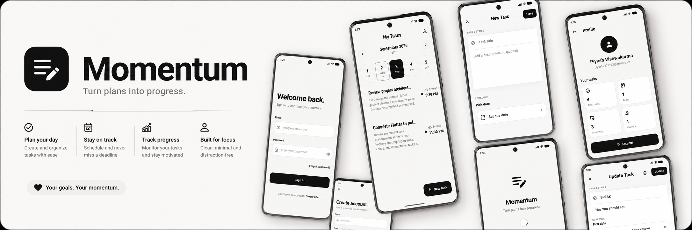
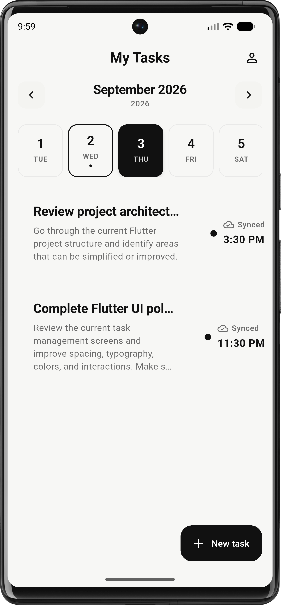
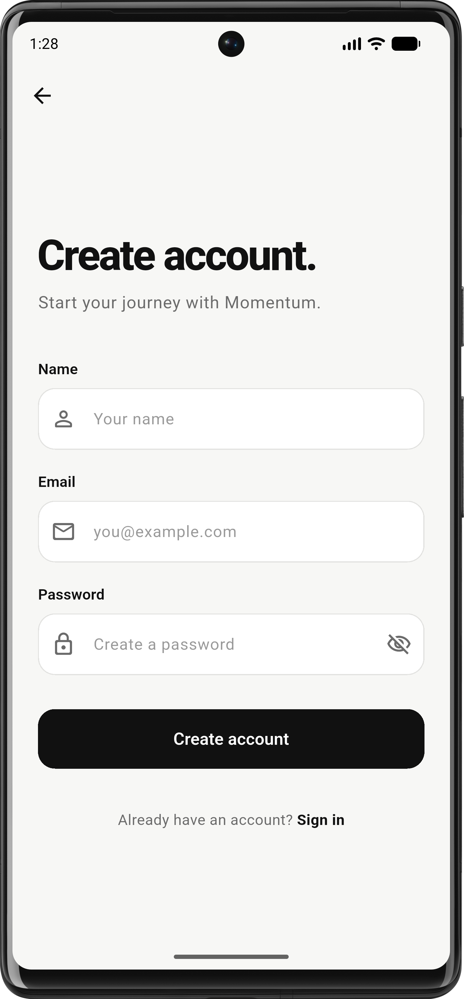
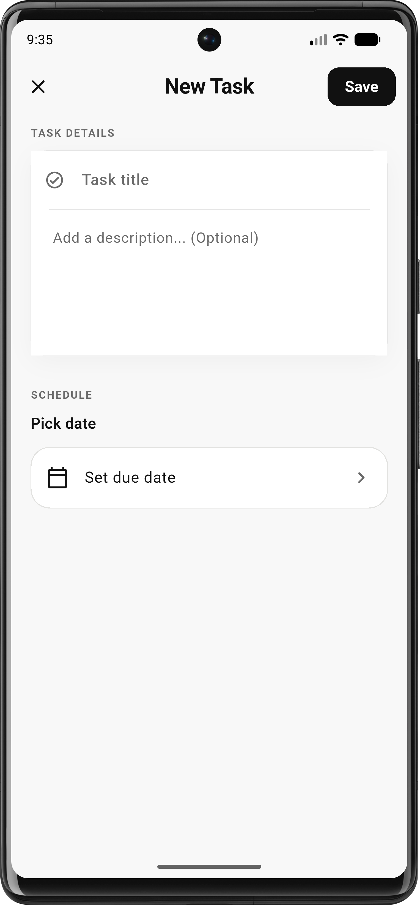
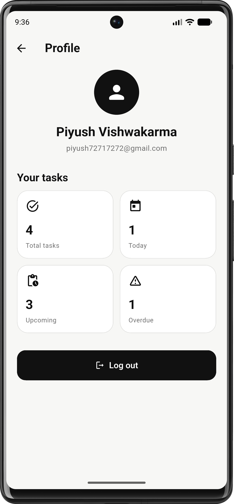
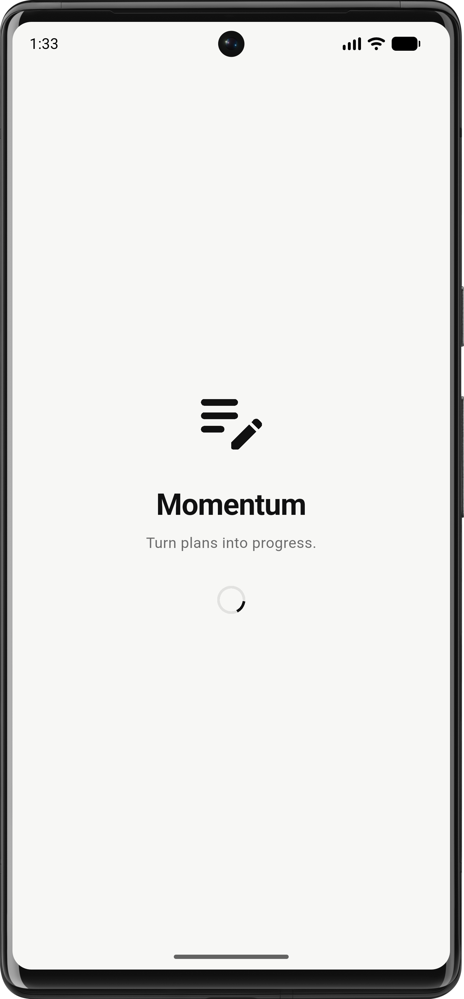

# Momentum

> **Turn plans into progress.**

Momentum is a simple, focused task management application built with Flutter and Node.js. It helps users create, schedule, manage, and track their daily tasks while providing both local and cloud persistence.

The project is structured as a full-stack application with a Flutter mobile frontend, Node.js/Express REST API, and PostgreSQL database.

<p align="center">
  
</p>

---

## ✨ Features

* 🔐 User authentication
* 📝 Create tasks
* ✏️ Update tasks
* 🗑️ Delete tasks
* 📅 Schedule tasks
* 📆 View tasks by date
* 📊 Task statistics
* 💾 Local SQLite persistence
* ☁️ PostgreSQL cloud persistence
* 🔄 REST API synchronization
* 🐳 Docker & Docker Compose support
* 📱 Android APK & AAB builds
* 🚀 CI/CD with GitHub Actions

---

## 🛠️ Tech Stack

### Frontend

* Flutter
* Dart
* flutter_bloc / Cubit
* SQLite / sqflite
* REST API

### Backend

* Node.js
* TypeScript
* Express.js
* PostgreSQL
* Drizzle ORM
* JWT Authentication
* Docker

### Deployment & CI/CD

* Docker
* Docker Compose
* Render
* GitHub Actions
* Android App Bundle (AAB)
* Android APK

---

## 📁 Project Structure

```text
momentum/
│
├── frontend/                    # Flutter mobile application
│   ├── lib/
│   ├── assets/
│   ├── android/
│   ├── pubspec.yaml
│   └── ...
│
├── backend/                     # Node.js + Express API
│   ├── src/
│   ├── drizzle/
│   ├── Dockerfile
│   ├── compose.yaml
│   ├── drizzle.config.ts
│   ├── nodemon.json
│   ├── tsconfig.json
│   ├── package.json
│   └── ...
│
├── screenshots/                 # Application screenshots
│   ├── home.png
│   ├── login.png
│   ├── new_task.png
│   ├── profile.png
│   ├── register.png
│   ├── splash.png
│   ├── banner.png
│   └── update_task.png
│
└── README.md
```

---

## 📱 Screenshots

### Home



### Login


### Register



### New Task



### Update Task


### Profile



### Splash



---

## 🏗️ Architecture

### Frontend

The Flutter application follows a layered architecture using Cubit for state management.

```text
Flutter Application
        │
        ▼
      UI
        │
        ▼
     Cubit
        │
        ▼
   Repository
      /   \
     /     \
    ▼       ▼
 SQLite   REST API
            │
            ▼
        Node.js API
```

The application can persist task data locally using SQLite while communicating with the backend for authentication and cloud persistence.

### Backend

```text
Flutter Application
        │
        │ HTTP / REST
        ▼
   Express REST API
        │
        ▼
    Drizzle ORM
        │
        ▼
    PostgreSQL
```

---

## 🔗 Repository

The complete source code for Momentum is available on GitHub:

**GitHub:**
https://github.com/YOUR_USERNAME/momentum

Replace `YOUR_USERNAME/momentum` with your actual repository URL.

---

# 🚀 Running Locally

## Prerequisites

Make sure you have installed:

* Flutter
* Dart
* Node.js
* npm
* PostgreSQL
* Docker Desktop (optional)

---

## 📱 Frontend

Navigate to the Flutter project:

```bash
cd frontend
```

Install dependencies:

```bash
flutter pub get
```

Create the environment file:

```env
BACKEND_URL=http://localhost:8000/api/v1
```

Run the application:

```bash
flutter run
```

---

# 🖥️ Backend

Navigate to the backend:

```bash
cd backend
```

Install dependencies:

```bash
npm install
```

Create a `.env` file:

```env
NODE_ENV=development

PORT=8000

POSTGRES_HOST=localhost
POSTGRES_PORT=5432
POSTGRES_USER=momentum_app
POSTGRES_PASSWORD=your_password
POSTGRES_DB=momentum

JWT_SECRET=your_jwt_secret

LOG_LEVEL=info

RESEND_API_KEY=re_xxxxxxxxx
MAIL_FROM=Momentum <onboarding@resend.dev>

FRONTEND_URL=http://localhost:3000
```

Start the development server:

```bash
npm run dev
```

The API will be available at:

```text
http://localhost:8000
```

---

# 🗄️ Database & Drizzle

Momentum uses PostgreSQL with Drizzle ORM.

After modifying the database schema:

```bash
npx drizzle-kit generate
```

Apply migrations:

```bash
npx drizzle-kit migrate
```

The Drizzle configuration is located at:

```text
backend/drizzle.config.ts
```

Migration files are stored in:

```text
backend/drizzle/
```

---

# 🐳 Docker

The backend and PostgreSQL database can also be started using Docker Compose.

From the `backend` directory:

```bash
docker compose up --build
```

Stop the containers:

```bash
docker compose down
```

To remove the database volume as well:

```bash
docker compose down -v
```

---

# 🌐 Backend Deployment

The Momentum backend is deployed as a Docker-based Node.js service.

### Production Architecture

```text
Flutter App
     │
     │ HTTPS
     ▼
Render Web Service
     │
     ▼
Node.js + Express
     │
     ▼
PostgreSQL
```

The production backend uses a PostgreSQL `DATABASE_URL` and Drizzle migrations.

The backend Docker container runs database migrations before starting the API server.

```bash
npm run db:migrate
npm start
```

### Production Environment

The backend requires environment variables such as:

```env
NODE_ENV=development
PORT=8000

DATABASE_URL=DATABASE_URL

JWT_SECRET=your_jwt_secret
LOG_LEVEL=info

RESEND_API_KEY=re_xxxxxxxxx
MAIL_FROM=Momentum <onboarding@resend.dev>
FRONTEND_URL=http://localhost:3000
```

> Never commit production credentials, database passwords, JWT secrets, API keys, or `.env` files to GitHub.

---

# 🔌 API

The backend exposes REST APIs for authentication and task management.

Base URL:

```text
/api/v1
```

### Health

```http
GET /api/v1/health
```

### Authentication

```text
/api/v1/auth
```

Typical authentication operations include:

```text
POST /register
POST /login
POST /forgot-password
POST /reset-password
GET  /me
```

### Tasks

```text
/api/v1/tasks
```

Task operations include:

```text
GET    /
POST   /
GET    /:id
PATCH  /:id
DELETE /:id
```

> Check the backend route files for the complete and current API contract.

---

# 📦 Android Releases

Android builds are generated using GitHub Actions.

The workflow builds both:

```text
APK
AAB
```

### APK

The APK can be used for direct Android installation and testing.

### AAB

The Android App Bundle (`.aab`) is intended for distribution through Google Play.

---

## ⚙️ GitHub Actions

The project includes a GitHub Actions workflow for automatically building the Flutter Android application.

The workflow:

1. Checks out the repository
2. Sets up Java
3. Sets up Flutter
4. Installs Flutter dependencies
5. Creates the `.env` file
6. Runs Flutter analysis
7. Builds the release APK
8. Builds the release AAB
9. Uploads both artifacts

Workflow location:

```text
.github/workflows/main.yml
```

The frontend is located in:

```text
frontend/
```

and the workflow executes Flutter commands from that directory.

---

# 📥 App Releases

Android release builds are available from the GitHub Actions artifacts.

After a successful workflow run:

```text
GitHub
  ↓
Actions
  ↓
Build Flutter Android
  ↓
Artifacts
  ├── app-release-apk
  └── app-release-aab
```

Download the appropriate artifact from the workflow run.

---

# 🔐 Environment Variables

### Frontend

The Flutter application requires:

```env
BACKEND_URL=https://your-backend-url
```

### Backend

The backend requires PostgreSQL and authentication configuration:

```env
NODE_ENV=development
PORT=8000

DATABASE_URL=DATABASE_URL

JWT_SECRET=your_jwt_secret
LOG_LEVEL=info

RESEND_API_KEY=re_xxxxxxxxx
MAIL_FROM=Momentum <onboarding@resend.dev>
FRONTEND_URL=http://localhost:3000
```

Additional email configuration may be required for password-reset functionality.

---

# 📌 Development Workflow

A typical development workflow is:

```text
1. Modify Flutter UI / backend
          ↓
2. Run application locally
          ↓
3. Test API
          ↓
4. Modify database schema if required
          ↓
5. Generate Drizzle migration
          ↓
6. Apply migration
          ↓
7. Commit changes
          ↓
8. Push to GitHub
          ↓
9. GitHub Actions builds Android
          ↓
10. Deploy backend
```

---

# 📄 License

This project is currently intended for learning and personal use.

---

## 👨‍💻 Author

**Piyush Vishwakarma**

Built with Flutter, Node.js, PostgreSQL and a lot of ☕.

---

⭐ If you find Momentum useful or interesting, consider starring the repository.
