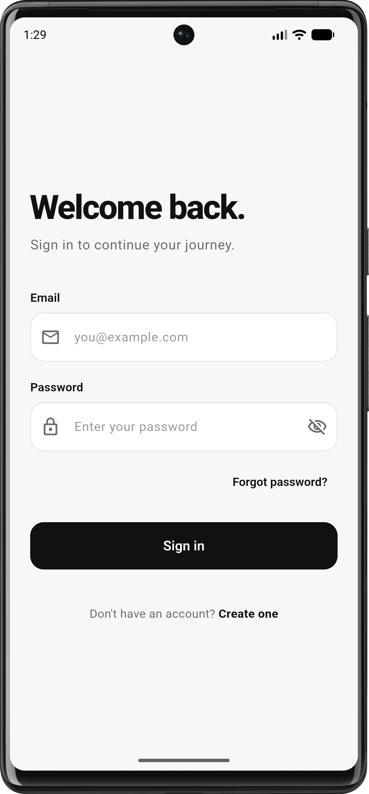
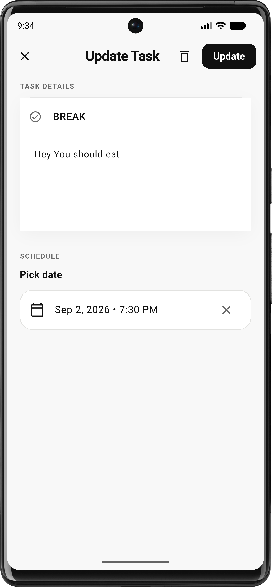

# Momentum — Frontend

Momentum is a simple, focused task management application built with **Flutter**. It is designed to
help you turn plans into progress by providing a clean task-management experience with
authentication, local persistence, and synchronization with the backend API.

## ✨ Features

* 🔐 User authentication
* 📝 Create, update, and delete tasks
* 📋 View and manage tasks
* 🔄 Synchronize local tasks with the backend
* 💾 Offline-first local storage using SQLite
* ⚡ State management using Cubit
* 🌐 REST API integration
* 🔑 JWT-based authentication
* 🎨 Clean and focused UI
* 📱 Responsive Flutter interface

---

## 🛠️ Tech Stack

| Technology           | Purpose                          |
|----------------------|----------------------------------|
| Flutter              | Cross-platform UI                |
| Dart                 | Application programming language |
| flutter_bloc / Cubit | State management                 |
| Sqflite              | Local SQLite database            |
| HTTP / Dio           | API communication                |
| JWT                  | Authentication                   |
| REST API             | Backend communication            |

---

## 📁 Project Structure

```text
frontend/
├── android/
├── ios/
├── lib/
│   ├── core/
│   │   ├── constants/
│   │   ├── database/
│   │   ├── network/
│   │   ├── storage/
│   │   └── utils/
│   │
│   ├── features/
│   │   ├── auth/
│   │   │   ├── data/
│   │   │   ├── cubit/
│   │   │   ├── models/
│   │   │   ├── screens/
│   │   │   └── widgets/
│   │   │
│   │   └── tasks/
│   │       ├── data/
│   │       ├── cubit/
│   │       ├── models/
│   │       ├── screens/
│   │       └── widgets/
│   │
│   ├── app.dart
│   └── main.dart
│
├── assets/
│   ├── images/
│   └── screenshots/
│       ├── login.png
│       ├── register.png
│       ├── home.png
│       ├── create_task.png
│       ├── task_details.png
│       └── profile.png
│
├── test/
├── pubspec.yaml
└── README.md
```

> The exact directory structure may vary depending on the implementation.

---

# 🏗️ Architecture

The frontend follows a feature-oriented architecture with **Cubit** for state management.

```text
UI / Screens
     │
     ▼
   Cubit
     │
     ▼
 Repository / Data Layer
     │
     ├──────────────► SQLite
     │                 │
     │                 ▼
     │             Local Tasks
     │
     └──────────────► REST API
                       │
                       ▼
                    Backend
```

The application uses local SQLite storage to provide fast access to task data while the backend
remains the source for synchronized server-side data.

---

# 🔐 Authentication Flow

Momentum uses JWT authentication.

```text
User
 │
 ├── Register
 │      │
 │      ▼
 │   Backend
 │      │
 │      ▼
 │   JWT Token
 │
 └── Login
        │
        ▼
      Backend
        │
        ▼
      JWT Token
        │
        ▼
   Local Storage
        │
        ▼
Authenticated API Requests
```

The JWT token is attached to protected API requests using the `Authorization` header:

```http
Authorization: Bearer <JWT_TOKEN>
```

---

# 💾 Local Database

Momentum uses **SQLite through Sqflite** for local task persistence.

Local storage allows the application to:

* Load tasks quickly
* Keep task data available locally
* Reduce unnecessary API requests
* Support offline task access
* Synchronize changes with the backend

A simplified task table can contain:

```text
tasks
├── id
├── title
├── description
├── completed
├── created_at
└── updated_at
```

The local database should be treated as the application's local cache/storage layer.

---

# 🔄 Task Synchronization

The frontend communicates with the backend using REST APIs.

Typical synchronization flow:

```text
Local SQLite
     │
     │ GET local tasks
     ▼
   Cubit
     │
     │ API request
     ▼
 Backend API
     │
     ▼
 PostgreSQL
```

The `/api/tasks/sync` endpoint can be used by the application to synchronize task data.

---

# 🌐 API Configuration

Configure the backend URL inside the frontend environment/configuration.

Example:

```dart

const String baseUrl = 'http://localhost:3000/api';
```

For an Android emulator, the backend running on the development machine may require:

```dart

const String baseUrl = 'http://10.0.2.2:3000/api';
```

For a physical device, use the development machine's local network IP:

```dart

const String baseUrl = 'http://192.168.x.x:3000/api';
```

Do not hard-code production URLs directly throughout the application. Keep the API base URL in one
configuration location.

---

# 📸 Screenshots

## Login



## Register


## Home / Tasks


## Create Task


## Update Task



## Profile


> Place your actual screenshots inside `assets/screenshots/` using the filenames above, or update
> the paths to match your screenshots.

---

# 🚀 Getting Started

## Prerequisites

Make sure you have installed:

* Flutter SDK
* Dart SDK
* Android Studio or Xcode
* Android SDK / iOS tooling
* A running Momentum backend

Check Flutter installation:

```bash
flutter doctor
```

---

## Installation

Clone the repository:

```bash
git clone https://github.com/piro-piyush/momentum.git
```

Move into the frontend directory:

```bash
cd frontend
```

Install dependencies:

```bash
flutter pub get
```

---

## Run the Application

Run on a connected device or emulator:

```bash
flutter run
```

Run on a specific device:

```bash
flutter devices
flutter run -d <device-id>
```

---

# 🧪 Testing

Run all Flutter tests:

```bash
flutter test
```

Analyze the project:

```bash
flutter analyze
```

Format the code:

```bash
dart format .
```

---

# 🔑 Authentication State

The application should maintain authentication state through Cubit.

A simplified state flow:

```text
Initial
  │
  ▼
Checking Authentication
  │
  ├── Token exists ──► Authenticated
  │
  └── No token ──────► Unauthenticated
```

Typical authentication Cubit responsibilities:

* Login
* Register
* Logout
* Check token
* Load current user
* Handle authentication errors

---

# 📋 Task State

Task Cubit manages the task lifecycle:

```text
Initial
  │
  ▼
Loading Tasks
  │
  ▼
Loaded
  │
  ├── Create Task
  ├── Update Task
  ├── Delete Task
  └── Sync Tasks
```

The UI should react to Cubit state changes rather than directly managing API/database operations.

---

# 🌍 Production Build

Android:

```bash
flutter build apk --release
```

Android App Bundle:

```bash
flutter build appbundle --release
```

iOS:

```bash
flutter build ios --release
```

---

# 📝 Development Guidelines

* Keep business logic inside Cubits/repositories rather than widgets.
* Keep API communication inside the data/network layer.
* Keep SQLite operations inside the database layer.
* Do not store JWT tokens directly inside widgets.
* Avoid duplicating API URLs.
* Handle loading, success, and error states explicitly.
* Keep widgets focused on presentation.
* Use meaningful names for Cubits, states, models, and repositories.

---

# 📌 Future Improvements

Potential improvements include:

* Offline queue for pending changes
* Background synchronization
* Task priorities
* Due dates and reminders
* Categories
* Search and filtering
* Push notifications
* Recurring tasks
* Dark mode
* Improved conflict resolution

---

## 📄 License

This project is intended for educational and personal development purposes.
